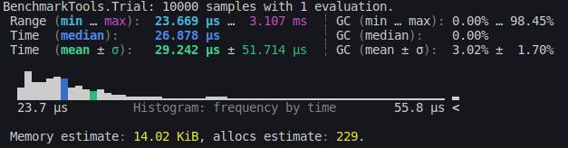
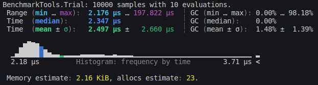

# DigitInterface.jl
A fast, low-latency Julia package for directly interfacing with the Digit Robot 
and its accessories.

## Features
* Fast querying of robot's state estimate. 
  State estimation runs at 34.5kHz, which is over 100x faster than ROS alternative.
  Below is the benchmarking results.
  

* Fast transmission of command torques and velocities. Runs at over 402.5kHz.
    

* Features API for controlling an attached gripper to Digit over serial communication
* Features API for accessing Realsense camera Point cloud data

## Installation
1. Open your Julia REPL by typing  `julia` in your terminal.
2. Press `]` on your keyboard to enter the package manager
3. Enter command `add https://github.com/adubredu/DigitInterface.jl"` and press 
`Enter` on your keyboard to install this package.
4. Press the `Backspace` key on your keyboard to return to the REPL

## Usage
Check the [examples](examples) folder for usage examples.